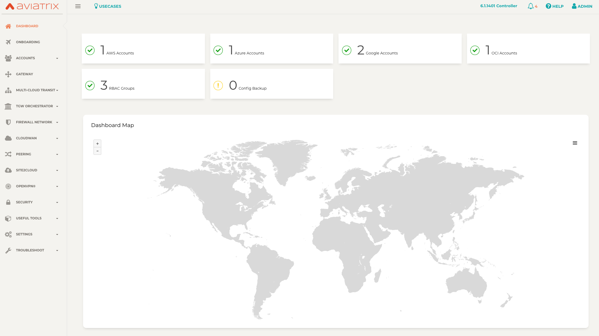

# Derby

### Summary

This standard POC builds Aviatrix Transit in AWS with FireNet. Refer to the bill of materials below for additional detail.

### BOM

- 2 Aviatrix Transit FireNet in AWS, 2 regions, one with 3 spokes, one with 2 spokes
- Aviatrix Insane High-Performance encryption enabled between AWS Transit regions and AWS Spokes

### Architecture


### Software Version Requirements

Component | Version
--- | ---
Aviatrix Controller | (6.2) UserConnect-6.2.1742 
Aviatrix Terraform Provider | 2.17
Terraform | 0.12

### Modules

Module Name | Version | Description
:--- | :--- | :---
[terraform-aviatrix-modules/aws-transit-firenet/aviatrix](https://registry.terraform.io/modules/terraform-aviatrix-modules/aws-transit-firenet/aviatrix/1.1.1) | 1.1.1 | This module deploys a VPC, Aviatrix transit gateways and firewall instances
[terraform-aviatrix-modules/aws-spoke/aviatrix](https://registry.terraform.io/modules/terraform-aviatrix-modules/aws-spoke/aviatrix/1.1.1) | 1.1.1 | This module deploys a VPC and an Aviatrix spoke gateway in AWS and attaches it to an Aviatrix Transit Gateway
[terraform-aviatrix-modules/mc-transit-peering/aviatrix](https://registry.terraform.io/modules/terraform-aviatrix-modules/mc-transit-peering/aviatrix/1.0.0) | 1.0.0 | Creates a full mesh transit peering from a list of transit gateway names

### Variables

The variables are defined in ```terraform.tfvars.template```.

Edit them to reflect Access Accounts available, and regions in scope. Save the edited file as ```terraform.auto.tfvars``` and continue with Terraform workflow.

**Note:** ```ha_enabled = false``` controls whether ha is built for spokes. 

### Prerequisites

- Software version requirements met
- Aviatrix Controller with Access Accounts defined for AWS 
- Sufficient limits in place for each region in scope **_(EIPs, Compute quotas, etc.)_**
- Active subscriptions for the NGFW firewall images in scope
- terraform .12 in the user environment ```terraform -v```

### Workflow

- Modify ```terraform.auto.tfvars.template``` _(i.e. access accounts, regions, cidrs, etc.)_ and save the file as ```terraform.auto.tfvars```
- ```terraform init```
- ```terraform plan```
- ```terraform apply --auto-approve```

### Backend Configuration (Optional)

For long-running infrastructure provisioning some users find it beneficial to take advantage of remote execution and state management in Terraform Cloud.

- Modify ```backend.tf.template``` to reflect your Terraform organization and workspace

### What to expect

#### Before


#### After (with ha spokes enabled)


A significant amount of infrastructure will be provisioned. Expect it to run for approx 2 hours. 

- Observe progress in Aviatrix Controller
- Observe progress in terminal
- Observe progress in Terraform Cloud (Optional)

